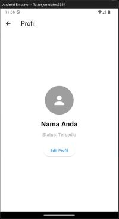
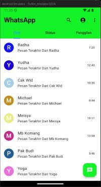
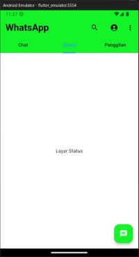
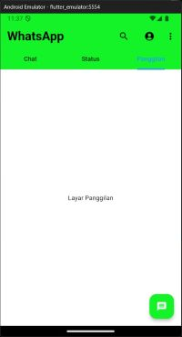

# Tugas Pertemua 03 
Mata Kuliah Mobile Programming
  CA224 240040040 I Made Agus Dwi Maha Putra
  Tugas membuat tampilan awal WhatsApp 

## Fitur Tampilan
+ Menampilkan Halaman Profil
+ Menampilkan Halaman Chat yang dapat digeser vertikal
+ Menampilkan Halaman Status
+ Menampilkan Halaman Panggilan

## Gambar Tampilan
   